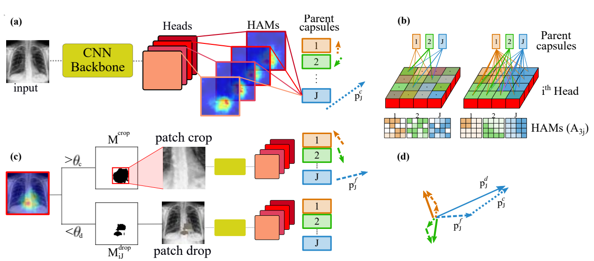

# DECAPS: Detail-Oriented Capsule Networks

This repository includes the Pytorch implementation of the methods described in our paper 
[DECAPS: Detail-Oriented Capsule Networks](https://arxiv.org/pdf/2007.05343.pdf).



*Fig1. Processing pipeline of the proposed DECAPS.*


## Train
- For training with default setup: ```python train.py ```

You can easily train your desired network configuration by passing the desired arguments as provided 
in the ```config.py``` file. For example:

- For training with batch size of 8: ```python train.py --batch_size=8```


## Test

- For testing the pretrained model run: ```python inference.py```

- For testing your trained model run: ```python inference.py --load_model_path=path_to_your_trained_model```


## Citation
If you found this repo useful, please use this bibtex to cite our paper:
```
@inproceedings{mobiny2020decaps,
  title={DECAPS: Detail-Oriented Capsule Networks},
  author={Mobiny, Aryan and Yuan, Pengyu and Cicalese, Pietro Antonio and Van Nguyen, Hien},
  booktitle={International Conference on Medical Image Computing and Computer-Assisted Intervention},
  pages={148--158},
  year={2020},
  organization={Springer}
}
```

